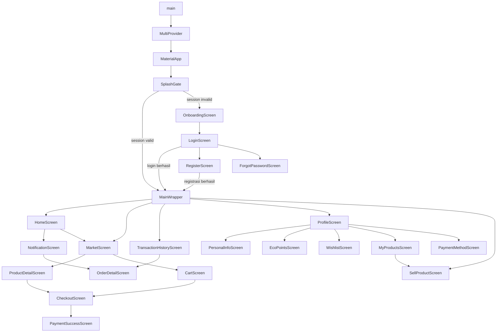

# Widget Tree dan Struktur Proyek EcoCycle

Dokumen ini merangkum struktur widget aplikasi Flutter EcoCycle berdasarkan kode pada folder `lib/`. Level yang ditampilkan adalah level arsitektur UI, sehingga widget kecil seperti `Padding`, `SizedBox`, `Text`, dan dekorasi visual tidak selalu ditulis satu per satu.

## 1. Root Widget Tree

Sumber utama: `lib/main.dart`.

```text
main()
`-- MultiProvider
    |-- ChangeNotifierProvider<UserProvider>
    |-- ChangeNotifierProvider<ThemeProvider>
    |-- ChangeNotifierProvider<CartProvider>
    |-- ChangeNotifierProvider<WishlistProvider>
    |-- ChangeNotifierProvider<NotificationProvider>
    `-- MyApp
        `-- Consumer<ThemeProvider>
            `-- MaterialApp
                |-- title: EcoCycle
                |-- theme: AppTheme.lightTheme
                |-- darkTheme: AppTheme.darkTheme
                |-- themeMode: themeProvider.themeMode
                `-- home: _SplashGate
                    `-- Scaffold
                        `-- Center
                            `-- TweenAnimationBuilder
                                `-- Column
                                    |-- Image.asset(ecocycle_logo.png)
                                    |-- Text(EcoCycle)
                                    `-- CircularProgressIndicator
```

Fungsi `_SplashGate` adalah memulihkan sesi login dari token yang tersimpan. Jika sesi valid, pengguna diarahkan ke `MainWrapper`. Jika tidak valid, pengguna diarahkan ke `OnboardingScreen`.

```text
_SplashGate
|-- restoreSession()
|-- jika berhasil:
|   |-- CartProvider.load()
|   |-- WishlistProvider.load()
|   |-- NotificationProvider.refresh()
|   `-- Navigator.pushReplacement(MainWrapper)
`-- jika gagal:
    `-- Navigator.pushReplacement(OnboardingScreen)
```

## 2. Shell Navigasi Utama

Sumber utama: `lib/screens/main_wrapper.dart`.

```text
MainWrapper
`-- Scaffold
    |-- drawer: AppDrawer
    |-- body: IndexedStack
    |   |-- index 0: HomeScreen
    |   |-- index 1: MarketScreen
    |   |-- index 2: SizedBox placeholder untuk tombol tambah
    |   |-- index 3: TransactionHistoryScreen(embedded: true)
    |   `-- index 4: ProfileScreen
    `-- bottomNavigationBar: AppBottomNavBar
        |-- Beranda -> HomeScreen
        |-- Pasar -> MarketScreen
        |-- Tombol tambah tengah -> SellProductScreen
        |-- Pesanan -> TransactionHistoryScreen
        `-- Profil -> ProfileScreen
```

`MainWrapper` menjadi container utama setelah user login. Navigasi tab menggunakan `IndexedStack`, sehingga state halaman tab tetap tersimpan saat pindah tab.

## 3. Auth dan Onboarding

Sumber utama:

- `lib/screens/onboarding/onboarding_screen.dart`
- `lib/screens/auth/login_screen.dart`
- `lib/screens/auth/register_screen.dart`
- `lib/screens/auth/forgot_password_screen.dart`

```text
OnboardingScreen
`-- Scaffold
    `-- SafeArea
        `-- Stack
            |-- PageView.builder
            |   `-- _OnboardingPage
            |       |-- Image.asset(onboarding image)
            |       |-- Text(title)
            |       `-- Text(description)
            |-- tombol Lewati
            |-- app bar mini untuk halaman > 0
            `-- bottom section
                |-- indikator halaman
                |-- tombol Lanjut/Mulai
                `-- tombol Kembali
```

```text
LoginScreen
`-- Scaffold
    `-- SafeArea
        `-- SingleChildScrollView
            `-- Column
                |-- app bar logo EcoCycle
                |-- hero image
                |-- heading
                |-- LabeledField(email)
                |-- password field
                |-- tombol Masuk
                |-- link Daftar -> RegisterScreen
                `-- link Lupa Kata Sandi -> ForgotPasswordScreen
```

```text
RegisterScreen
`-- Scaffold
    `-- Stack
        |-- hero image atas
        `-- SingleChildScrollView
            `-- Column
                |-- brand overlay
                |-- heading
                |-- input nama, email, telepon, password
                |-- checkbox persetujuan
                |-- link TermsOfServiceScreen
                |-- link PrivacyPolicyScreen
                `-- tombol Buat Akun -> MainWrapper
```

```text
ForgotPasswordScreen
`-- Scaffold
    |-- AppBar
    `-- SafeArea
        `-- SingleChildScrollView
            `-- Column
                |-- heading sesuai tahap
                |-- step 1: input email dan telepon
                |-- step 2: input OTP
                |-- step 3: input password baru
                `-- tombol aksi utama
```

## 4. Home dan Drawer

Sumber utama:

- `lib/screens/home/home_screen.dart`
- `lib/widgets/app_drawer.dart`

```text
HomeScreen
`-- Scaffold
    `-- SafeArea
        `-- RefreshIndicator
            `-- ListView
                |-- header
                |   |-- menu button -> AppDrawer
                |   |-- greeting user
                |   `-- notification icon -> NotificationScreen
                |-- search bar -> MarketScreen
                |-- category shortcuts
                |   |-- Pupuk & Kompos -> MarketScreen(category)
                |   `-- Karya Daur Ulang -> MarketScreen(category)
                |-- section header Produk Terlaris
                `-- FutureBuilder<List<Product>>
                    `-- GridView.builder
                        `-- _HomeProductCard
                            |-- ProductImage
                            |-- ProductMetaRow
                            `-- harga produk
```

```text
AppDrawer
`-- Drawer
    `-- SafeArea
        `-- Column
            |-- ListView
            |   |-- _DrawerHeader
            |   |-- Informasi Pribadi -> PersonalInfoScreen
            |   |-- Produk Saya -> MyProductsScreen
            |   |-- Favorit -> WishlistScreen
            |   |-- Metode Pembayaran -> PaymentMethodScreen
            |   |-- Notifikasi -> NotificationScreen
            |   |-- Tentang Aplikasi -> AboutDialog
            |   `-- switch tema terang/gelap
            `-- tombol logout
```

## 5. Marketplace, Detail Produk, Keranjang, dan Checkout

Sumber utama:

- `lib/screens/market/market_screen.dart`
- `lib/screens/market/product_detail_screen.dart`
- `lib/screens/cart/cart_screen.dart`
- `lib/screens/market/checkout_screen.dart`
- `lib/screens/payment/payment_success_screen.dart`

```text
MarketScreen
`-- Scaffold
    `-- SafeArea
        `-- Column
            |-- header Eco-Market
            |   |-- filter button -> modal filter
            |   |-- sort button -> modal sort
            |   `-- cart icon -> CartScreen
            |-- search TextField
            |-- category chips horizontal
            `-- Expanded
                `-- RefreshIndicator
                    `-- _buildContent()
                        |-- loading: CircularProgressIndicator
                        |-- error/empty: message view
                        `-- GridView.builder
                            `-- _ProductCard
                                |-- ProductImage
                                |-- ProductMetaRow
                                `-- tap -> ProductDetailScreen
```

```text
ProductDetailScreen
`-- Scaffold
    `-- Stack
        |-- CustomScrollView
        |   |-- SliverAppBar
        |   |   `-- FlexibleSpaceBar
        |   |       `-- gallery produk
        |   `-- SliverToBoxAdapter
        |       `-- Column
        |           |-- title, harga, rating, stok
        |           |-- seller card
        |           |-- deskripsi produk
        |           `-- review list
        `-- bottom bar
            |-- jika pembeli: tambah keranjang / beli sekarang
            |-- beli sekarang -> CheckoutScreen
            `-- jika pemilik produk: edit -> SellProductScreen(product)
```

```text
CartScreen
`-- Scaffold
    |-- AppBar(Keranjang)
    `-- Consumer<CartProvider>
        |-- loading: CircularProgressIndicator
        |-- kosong/error: empty message
        `-- Column
            |-- ListView.separated
            |   `-- item keranjang
            |       |-- ProductImage
            |       |-- nama produk
            |       |-- kontrol jumlah
            |       `-- hapus item
            `-- bottom bar
                |-- total harga
                `-- Checkout -> CheckoutScreen
```

```text
CheckoutScreen
`-- Scaffold
    `-- SafeArea
        `-- Column
            |-- custom app bar
            |-- Expanded
            |   `-- SingleChildScrollView
            |       |-- alamat pengiriman
            |       |-- ringkasan pesanan
            |       |-- metode pengiriman
            |       |   |-- estimasi ongkir
            |       |   `-- map lokasi jika tersedia
            |       |-- metode pembayaran
            |       `-- ringkasan harga
            `-- bottom bar
                `-- buat pesanan -> PaymentSuccessScreen
```

```text
PaymentSuccessScreen
`-- Scaffold
    `-- SafeArea
        `-- Column
            |-- top bar
            |-- success icon
            |-- ucapan terima kasih
            |-- detail transaksi
            |-- eco impact banner
            `-- bottom buttons
                |-- Lihat Pesanan -> TransactionHistoryScreen
                `-- Kembali ke Beranda -> MainWrapper
```

## 6. Pesanan dan Riwayat Transaksi

Sumber utama:

- `lib/screens/payment/transaction_history_screen.dart`
- `lib/screens/payment/order_detail_screen.dart`

```text
TransactionHistoryScreen
`-- DefaultTabController(length: 2)
    `-- Scaffold
        |-- AppBar
        |   `-- TabBar
        |       |-- Pembelian
        |       `-- Penjualan
        `-- TabBarView
            |-- _OrderListView(isSales: false)
            `-- _OrderListView(isSales: true)
```

```text
_OrderListView
`-- RefreshIndicator
    `-- _buildBody()
        |-- loading: CircularProgressIndicator
        |-- error/empty: ListView message
        `-- ListView.separated
            `-- order card
                |-- order code
                |-- PaymentStatusBadge
                |-- OrderStatusBadge
                |-- item pertama
                `-- tap -> OrderDetailScreen
```

```text
OrderDetailScreen
`-- Scaffold
    |-- AppBar(Detail Pesanan)
    `-- SafeArea
        `-- FutureBuilder<Order>
            |-- loading/error
            `-- ListView
                |-- informasi pesanan
                |-- daftar item
                |-- status pembayaran
                |-- status pengiriman
                `-- tombol aksi sesuai peran/status
```

## 7. Profil, Eco Points, Wishlist, dan Produk Saya

Sumber utama:

- `lib/screens/profile/profile_screen.dart`
- `lib/screens/profile/personal_info_screen.dart`
- `lib/screens/profile/eco_points_screen.dart`
- `lib/screens/wishlist/wishlist_screen.dart`
- `lib/screens/seller/my_products_screen.dart`
- `lib/screens/seller/sell_product_screen.dart`

```text
ProfileScreen
`-- Scaffold
    `-- SafeArea
        `-- RefreshIndicator
            `-- SingleChildScrollView
                `-- Column
                    |-- app bar Profil Saya
                    |-- ProfileAvatar
                    |-- nama, email, tanggal member
                    |-- Eco Points card -> EcoPointsScreen
                    |-- menu Informasi Pribadi -> PersonalInfoScreen
                    |-- menu Produk Saya -> MyProductsScreen
                    |-- menu Favorit -> WishlistScreen
                    |-- menu Metode Pembayaran -> PaymentMethodScreen
                    |-- menu Notifikasi -> NotificationScreen
                    `-- Keluar Akun -> logout dialog
```

```text
PersonalInfoScreen
`-- Scaffold
    `-- SafeArea
        `-- Column
            |-- custom app bar
            |-- SingleChildScrollView
            |   |-- ProfileAvatar
            |   |-- nama user
            |   |-- badge member
            |   `-- info card
            |       |-- nama
            |       |-- email
            |       |-- telepon
            |       |-- alamat/lokasi
            `-- tombol Simpan
```

```text
EcoPointsScreen
`-- Scaffold
    `-- SafeArea
        `-- Column
            |-- app bar
            `-- body
                |-- loading/error
                `-- ListView
                    |-- balance card
                    |-- tier card
                    |-- impact row
                    |-- tier list
                    `-- riwayat transaksi poin
```

```text
WishlistScreen
`-- Scaffold
    |-- AppBar(Favorit)
    `-- Consumer<WishlistProvider>
        |-- loading/empty
        `-- ListView.separated
            `-- product item favorit
```

```text
MyProductsScreen
`-- Scaffold
    |-- AppBar(Produk Saya)
    |-- FloatingActionButton -> SellProductScreen
    `-- FutureBuilder<List<Product>>
        |-- loading/error/empty
        `-- ListView.separated
            `-- item produk milik user
                |-- edit -> SellProductScreen(product)
                `-- hapus produk
```

```text
SellProductScreen
`-- Scaffold
    |-- AppBar(Jual Produk/Edit Produk)
    `-- SafeArea
        `-- SingleChildScrollView
            `-- Form
                |-- input nama produk
                |-- input kategori
                |-- input harga
                |-- input stok
                |-- input berat
                |-- input deskripsi
                |-- section lokasi penjual
                |-- section gambar produk
                `-- tombol simpan produk
```

## 8. Notifikasi dan Pembayaran

Sumber utama:

- `lib/screens/notification/notification_screen.dart`
- `lib/screens/payment/payment_method_screen.dart`
- `lib/screens/payment/payment_settings_screen.dart`

```text
NotificationScreen
`-- Scaffold
    |-- AppBar
    `-- SafeArea
        `-- Column
            |-- filter semua/belum dibaca
            `-- Consumer<NotificationProvider>
                |-- loading/empty
                `-- ListView.separated
                    `-- notification tile
                        `-- tap order notification -> OrderDetailScreen
```

```text
PaymentMethodScreen
`-- Scaffold
    `-- SafeArea
        `-- Column
            |-- custom app bar
            `-- body
                |-- saved methods section
                |   |-- empty state
                |   `-- method tile
                |-- quick actions
                |   |-- tambah metode -> bottom sheet
                |   `-- pengaturan -> PaymentSettingsScreen
                `-- _TambahMetodeSheet
                    `-- opsi e-wallet
```

```text
PaymentSettingsScreen
`-- Scaffold
    `-- SafeArea
        `-- Column
            |-- custom app bar
            `-- section pengaturan pembayaran
```

## 9. Komponen Reusable

Komponen yang dipakai berulang pada beberapa layar:

```text
lib/widgets/
|-- app_bottom_nav_bar.dart
|   `-- AppBottomNavBar, _NavItem
|-- app_drawer.dart
|   `-- AppDrawer, _DrawerHeader, _DrawerItem
|-- app_text_field.dart
|   `-- AppTextField, LabeledField
|-- order_status_badge.dart
|   `-- OrderStatusBadge, PaymentStatusBadge
|-- product_card_bits.dart
|   `-- ProductMetaRow, StokHabisBadge
|-- product_image.dart
|   `-- ProductImage
`-- profile_avatar.dart
    `-- ProfileAvatar
```

## 10. Peta Navigasi Aplikasi



## 11. Struktur Folder Proyek

Struktur ini dapat digunakan pada bagian "Struktur Proyek" laporan akhir.

```text
ecocycle/
|-- lib/
|   |-- main.dart
|   |-- constants/
|   |   |-- app_colors.dart
|   |   |-- eco_tier.dart
|   |   `-- shipping.dart
|   |-- models/
|   |   |-- notification_model.dart
|   |   |-- order_model.dart
|   |   `-- product_model.dart
|   |-- providers/
|   |   |-- cart_provider.dart
|   |   |-- notification_provider.dart
|   |   |-- theme_provider.dart
|   |   |-- user_provider.dart
|   |   `-- wishlist_provider.dart
|   |-- services/
|   |   |-- auth_api_service.dart
|   |   |-- cart_api_service.dart
|   |   |-- notification_api_service.dart
|   |   |-- order_api_service.dart
|   |   |-- payment_method_api_service.dart
|   |   |-- point_api_service.dart
|   |   |-- product_api_service.dart
|   |   `-- wishlist_api_service.dart
|   |-- screens/
|   |   |-- auth/
|   |   |-- cart/
|   |   |-- home/
|   |   |-- legal/
|   |   |-- market/
|   |   |-- notification/
|   |   |-- onboarding/
|   |   |-- payment/
|   |   |-- profile/
|   |   |-- seller/
|   |   `-- wishlist/
|   |-- utils/
|   `-- widgets/
|-- backend/
|   |-- src/
|   |   |-- app.js
|   |   |-- server.js
|   |   |-- config/
|   |   |-- controllers/
|   |   |-- middleware/
|   |   |-- routes/
|   |   |-- scripts/
|   |   `-- utils/
|   |-- package.json
|   `-- README.md
|-- database/
|   `-- ecocycle_pdm.sql
|-- assets/
|   |-- images/
|   `-- logo/
|-- fonts/
|-- test/
|-- tools/
|-- android/
|-- ios/
|-- web/
|-- windows/
|-- linux/
`-- macos/
```

## 12. Saran Penyajian di Laporan

Untuk laporan akhir, widget tree saja biasanya kurang menjelaskan struktur sistem secara utuh. Bagian yang disarankan:

1. Struktur folder proyek
   Jelaskan pembagian `lib/screens`, `lib/widgets`, `lib/providers`, `lib/services`, `backend/src`, dan `database`.

2. Widget tree utama
   Tampilkan tree dari `main()` sampai `MainWrapper`, lalu tree singkat per fitur utama.

3. Peta navigasi aplikasi
   Gunakan diagram Mermaid pada bagian 10 atau ubah menjadi gambar flowchart.

4. Arsitektur data sederhana

```text
Flutter UI Screens
`-- reusable Widgets
`-- Providers sebagai state management
`-- Services sebagai API client
`-- Express Backend Routes
`-- Controllers dan Utils
`-- MySQL Database
```

Dengan format tersebut, dosen bisa melihat hubungan antara tampilan, state management, API, dan database tanpa harus membaca seluruh kode.
